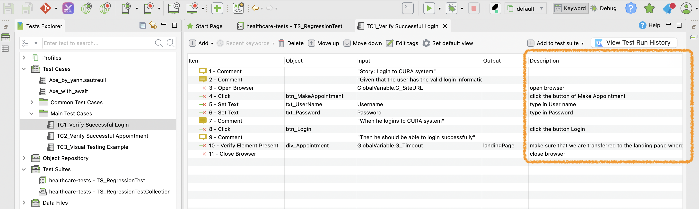

:REPOSITORY_URL: https://github.com/kazurayam/KS_HackingNewReportForStepDescription
:PAGES_URL: https://kazurayam.github.io/KS_HackingNewReportForStepDescription


= [Katalon Studio] Hacking New Report to insert Test Step Description

This is a small link:https://katalon.com/[Katalon Studio] project for demonstration purpose. This project proposes a solution to the issue raised at a topic in Katalon Community:

- link:https://forum.katalon.com/t/how-to-display-steps-description-into-new-html-report/173818/[How to display steps description into new HTML report?]

== Problem to solve

=== What is the *Test Step Description*

I need to start with explaining the background knowledge. Here is a sample Katalon Studio Test Case script:



Please find that the Manual View has a column titled `Description` for each test steps. For example, the 4th statement is attached with a description "**click the button of Make Appointment**"

In the Script view, you can see the same Test Case script in Groovy language.

- link:https://github.com/kazurayam/KS_HackingNewReportForStepDescription/Scripts/Main Test Cases/TC1_Verify Successful Login/Script1482850539026.groovy[]

The 4th statement is serialized as this:

[source,groovy]
----
include::../Scripts/Main Test Cases/TC1_Verify Successful Login/Script1482850539026.groovy[lines=12..13]
----

Please note that the `Description` of test case step is serialized as a string literal prepended to each command statements.

=== With v9.7.6, the HTML report showed Test Step Descriptions

I ran a Test Suite which includes the above Test Case script using the Katalon Studio v9.7.6, which generated a HTML report like this:

image::{PAGES_URL}/images/old_report_view.png[]

In this report, you can see a string "*Description: click the button of Make Appointment*" which was transfered from the Test Case script source into the report.

I could look into the HTML source of the report using the Chrome's Dev Tool. Here is the HTML fragment of that portion:

```
<div id="s1-t1-k4" class="keyword">
  <div class="element-header" onclick="toggleKeyword('s1-t1-k4')" title="click(findTestObject(&amp;quot;Page_CuraHomepage/btn_MakeAppointment&amp;quot;))">
    <span class="passed">TEST STEP: </span>
    <span>Description: <font>click the button of Make Appointment</font></span>
  </div>
  <div style="margin-left: 2.6cm; color:#808080; font-style: italic">
    <span>click(findTestObject("Page_CuraHomepage/btn_MakeAppointment"))</span>
    <span class="arg"></span>
  </div>
  <div class="children populated" style="display: block;">
    <table class="metadata keyword-metadata">
      <tbody>
        <tr>
          <th>Start / End / Elapsed:</th>
          <td>2025-12-25 09:05:48.480 / 2025-12-25 09:05:50.611 / 00:00:02.131</td>
        </tr>
      </tbody>
    </table>
    <table id="element-id-1" class="messages passed-message">
      <tbody>
        <tr class="message-row">
          <td class="time">09:05:50.593</td>
          <td class="passed level">PASSED</td>
          <td class="message">Object: 'Object Repository/Page_CuraHomepage/btn_MakeAppointment' is clicked on</td>
          <td class="select-text" onclick="javascript:selectMessage('element-id-1')" title="Select message text"></td>
        </tr>
      </tbody>
    </table>
  </div>
</div>
```

=== the new HTML report does not show the Test Step descriptions

Katalon Studio link:https://docs.katalon.com/katalon-studio/release-notes/katalon-studio-release-notes-version-10.x#version-1020[v10.2.0] introduced a new test suite HTML report template, which **does not show the Test Step descriptions at all**. The original poster of the topic in the Katalon Community link:https://forum.katalon.com/t/how-to-display-steps-description-into-new-html-report/173818/15[argued] that this is serious for him and requested a fix A.S.A.P.

Let me show you an evidence of the defect.

I ran the same Test Suite using Katalon Studio v10.4.2 which generated the following HTML report.

image::{PAGES_URL}/images/new_report_view.png[]

The following is the code fragmen portion which renders the test step of `click(findTestObject("Page_CuraHomepage/btn_MakeAppointment"))`. The `Description` is not rendered here obviously.

```
<div data-step-id="e8815d25-8461-4d84-ad55-1729307549a1" class="styled-2ypqurjb css-n9psmrl3">
  <div class="styled-0zpbks79 css-2ahub4jp">
    <div class="styled-h8dscuia css-86klhq7g"></div>
    <div class="styled-8pz5giae css-5ccya7qb">4</div>
    <div class="PASSED styled-d5acs925 css-yotkuj5h">TEST STEP:</div>
    <div class="styled-3y3nb1nx css-i2xncsag">click(findTestObject("Page_CuraHomepage/btn_MakeAppointment"))</div>
  </div>
  <div class="styled-ndbc9w1y css-ztd1lceq" style=""><div>
  <div class="styled-plfzeuq8 css-svkjq3zi">
    <table class="styled-pbxv2f49 css-l8qss2xy">
      <tbody>
        <tr>
          <td>
            <div class="styled-9dkxns5w css-zlw0gdna">Start / End / Elapsed:</div>
          </td>
          <td colspan="2">2025-12-25 07:40:02.7 / 2025-12-25 07:40:06.8<!----> / 4.97s</td>
        </tr>
        <tr>
          <td class="styled-6zbxitnu styled-owlluj6q css-51pcd8ej">07:40:06.776</td>
          <td class="PASSED styled-a4rgfxy5 styled-owlluj6q css-2hfe7esi">PASSED</td>
          <td class="styled-ytg4oasd styled-owlluj6q css-6ieh1xwd">
            <div class="styled-qwmta2un css-twy56hom">Object: 'Object Repository/Page_CuraHomepage/btn_MakeAppointment' is clicked on</div>
          </td>
        </tr>
      </tbody>
    </table>
  </div><div class="MuiBox-root css-26yrm988"><div class="styled-al7jglz2 MuiStack-root css-mjtibxsc"></div></div></div></div>
</div>
```

In order to solve this defect, the source of Katalon Studio need to be changed. Only Katalon can develop it. As long as they put lower primority for this issue in their backlog, the problem would remain unresolved.

== My solution


== How I developed the trick

=== Study on v9.7.6

I studied the source code of Katalon Studio v9.7.6 to find out how the HTML report generates the portion of Test Step Description.

I found link:{REPOSITORY_URL}/docs/katalon-studio-sources/versions/9.7.6/resources/source/com.kms.katalon.core/com/kms/katalon/core/reporting/template/hml_content.txt[9.7.6/resources/source/com.kms.katalon.core/com/kms/katalon/core/reporting/template/hml_content.txt] contains the relevant fragment at the line#239..259.

[source,html]
----
include::./katalon-studio-sources/versions/9.7.6/resources/source/com.kms.katalon.core/com/kms/katalon/core/reporting/template/hml_content.txt[lines=239..259]
----

Well, the following frament is especially interesting.

[source,html]
----
        {{if doc()}}
        <tr>
          <th>Description:</th>
          <td class="doc">{{html doc()}}</td>
        </tr>
        {{/if}}
----

I need to learn the grammer of link:https://github.com/codepb/jquery-template[jQuote Template]; I need to find out what `{{if docs()}}` means, I need to find out what `{{html doc()}}` does.

=== Study on v10.4.2

In the `{KATALON_STUDIO_INSTALLATION_DIRECTORY}/configuration/resources/html` directory, we can find the template files used by Katalon Studio v10.2+ to compile the new HTML reports.

[source,shell]
----
~/10.4.2/resources/html [1] $ ls -la | sed 's/kazuakiurayama//g'
total 2590
drwxr-xr-x  10  staff        320 2025-12-25 22:29 .
drwxr-xr-x   5  staff        160 2025-12-25 22:29 ..
-rwxr-xr-x   1  staff    1209163 2025-12-25 22:29 TestSuiteCollectionTemplate.html
-rwxr-xr-x   1  staff    1220331 2025-12-25 22:29 TestSuiteTemplate.html
-rwxr-xr-x   1  staff       6064 2025-12-25 22:29 html_collection_frame_template.txt
-rwxr-xr-x   1  staff      11420 2025-12-25 22:29 html_collection_index_template.txt
-rwxr-xr-x   1  staff      12775 2025-12-25 22:29 html_content.txt
-rwxr-xr-x   1  staff     186433 2025-12-25 22:29 html_template.txt
-rwxr-xr-x   1  staff       1022 2025-12-25 22:29 html_vars.txt
-rwxr-xr-x   1  staff       4371 2025-12-25 22:29 variables.txt
----

I tried to find and grep those files with the pattern string "TEST STEP". I found a mach in the `html_content.txt` file as follows:

[source,html]
----
include::./katalon-studio-sources/versions/10.4.2/resources/html/html_content.txt[lines=333..343]
----

.... Well, the `resources/html/html_content` file of v10.4.2 seems to be just the same as the `resources/sources/com/kms/katalon/core/reporting/template/html_content.txt`.

This finding suggested to me that `{{if doc()}}` was evaluated differently in v9.7.6 and v10.4.2. In v9.7.6, the `doc()` was evalutated true; therefore the `Description: xxxxxx` was rendered. But in v10.4.2, the `doc()` was evaluated false; therefore the `Description: xxxxxx` was NOT rendered.

So, I should find out what the `doc()` means, and find out the reason of the evaluation difference.

=== What is `doc()` ?

== Aha!

See https://forum.katalon.com/t/how-to-display-steps-description-into-new-html-report/173818/16


